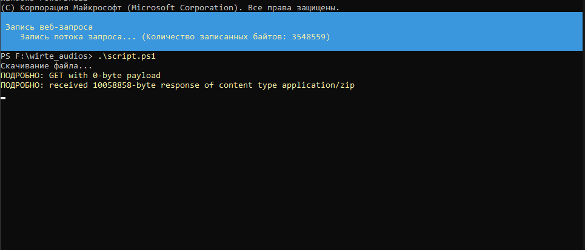

## Запись звуковых файлов на флешку

С помощью PowerShell скрипта последняя добавленая версия записей
скачивается из https://school-lab-updater.bast.ru/ и записывается 
на один из трех созданных разделов на microSD карте

### Алгоритм действий

0. Если система запрещает запускать PowerShell скрипты, то необходимо
выполнить команду Set-ExecutionPolicy и ввести Y

1. Запускаем PowerShell от имени администратора (ОБЯЗАТЕЛЬНО) 
и переходим в папку со скриптом и запускаем скрипт\

2. Начнется скачиваться архив с аудиофайлами.

Если вы запускаете скрипт не первый раз, то файл school_lab_audio.zip
уже будет присутствовать, и этот этап пропустится. Если необходимо
скачать архив заново, то удалите school_lab_audio.zip, который лежит в
одной папке со скриптом и перезапустите скрипт
3. Далее необходимо будет в окне выбрать накопитель (по букве) и нажать OK

В окне показываются только подключенные по USB
4. Подтвердите или отклоните форматирование и создание 3 новых разделов.
Все старые данные на накопителе будут удалены

5. Далее вместо одного раздела должно появиться 3 новых с названиями:
AUDIO, FRIMWARE, LOGS
6. После этого должна произойти распаковка скачаного архива в раздел
с названием AUDIO

Если этот пункт не начинает выполняться, попробуйте нажать Enter
В редких случаях буква раздела AUDIO не определяется, тогда будет открыто
окно выбора раздела (как в пункте 3), на который нужно будет записать аудиофайлы

